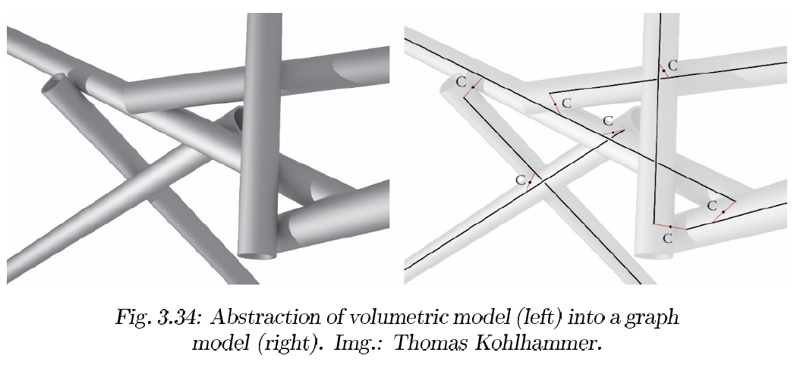

.. _compasEP_fab0:

*********************************************************
fab0: data structures for modeling discrete assembly
*********************************************************

- CompasEP: fab0
- Title: data structures for modeling discrete assembly
- Author: Yijiang Huang <yijiangh@mit.edu>
- Status: Draft
- Type: Standard Track
- Content-Type: text/x-rst
- Created: 25-Jan-2019
- Post-History: ?

Outline
=======

#. Abstract_
#. Motivation_
#. Definitions_
#. Requirements_
#. Proposal_
#. `User inputs - a Grasshopper example`_
#. `Todo's`_
#. References_
#. Copyright_

.. #. `Design Assumptions`_
.. #. `Backwards Compatibility`_

Abstract
========

This CompasEP proposes an unified data structure for encoding all the necessary information of an assembly of discrete geometries in an architectural assembly planning context. The proposed data structure includes information on unit geometries, connectivity, structural modeling, robotic assembly/fabrication. The implemented script is intended as an addition of the `compas_fab` package.

Definitions
===========

The following definitions and naming conventions are used throughout:

X_from_Y frame frame description
---------------------------------
We use the naming conventions used in pybullet_planning [#pb_planning]_ to describe the frames. `X_from_Y` describes the transformation of frame Y *from* frame X. Using the symbols introduced in examples_fundamentals, `X_from_Y` is equivalent to :math:`T_{XY}`.

Here are some examples used in this proposal:

world_from_grasp

    end effector (EE)'s TCP (Tool Center Point) grasp plane in the world coordinate frame (:math:`W_{CF}`).

object_from_grasp

    The EE's TCF in the object coordinate frame (:math:`O_{CF}`), i.e. the transformation **from** :math:`O_{CF}` **to** `world_from_grasp`. We use this relative representation of grasp poses inside the proposed data structure, since `world_from_grasp` can be easily recovered by ``world_from_grasp = world_from_object * object_from_grasp``. This transformation describes how the end effector (gripper) registers with the object locally.

.. figure:: ../../examples/01_fundamentals/files/02_coordinate_frames.jpg
    :figclass: figure
    :class: figure-img img-fluid
    :scale: 50%

Assembly, Element, Joints
-------------------------

- Assembly: an assembly is a collection of discrete objects, where objects are connected together by joints. Examples are shown in the :numref:`fig-assembly_examples` below.
- Element: an element is a discrete object in an assembly.

.. _fig-assembly_examples:

    Examples for assembly modeling, from [#compas_fab_slides]_

Object pick & place frames
---------------------------
In the proposed implementation, an object's geometric data (meshes or parametric shapes) is maintained always in a relative fashion. This means mesh data are maintained with their object coordinate frame coincide with the world frame. In this proposal, unless especially noted, an object's `pose` or `frame` refers to its object cooridate frame relative to the world frame.

In a picknplace context, an object is also associated with two frames: `initial_frame` and `goal_frame` to indicate their poses in the world. `initial_frame` represents the object's pose before it's picked up, usually its poses on a material rack. `goal_frame` represents the object's pose specified in the target design assembly.

Grasps
------
A grasp describe the relative transformation between an object coodinate frame and the end effector's TCP (Tool Center Plane), i.e. `object_from_grasp`. In this proposal, a grasp contains transformation in three stages: `approach`, `attach`, and `retreat`.

Since there might be several ways to grasp an object, we associate an object with a list of grasps. A path planner should later choose a feasible grasp out of these candidates grasps. See section `Grasp`_ for a detailed explanation.

As we will see later in section `Why do we have two lists of initial_frame and goal_frame?`_, we will maintain four lists of `initial_frames`, `goal_frames`, `pick_grasps`, `place_grasps` to describe the candidate grasp poses.

Motivation
==========

``TODO``

My current implementation looks more like a *extension* class of the abstract base class of `AssemblyBase` discussed in the issue [#compas_fab94]_. I will hand it over to Gonzalo for the class abstraction and the design of class hierachy. Thus, this proposal covers only the robotic assembly-related parts.

Requirements
============

For robotic assembly planning purposes, the proposed assembly class should be able to capture the following information:

**Connectivity**: Modeling relationship between elements
  - Which element is connected to which?
    - "semantic link" between objects within the assembly
  - How are they connected physically?
    - pure contact (e.g. contact faces between masonry blocks)
    - extra physical joints? (e.g. dowels to connect two wood beams)
  - How to describe the solid geometric relationship between the joint and the element, so we can generate meshes/breps when design decisions are settled? (boolean operations?)
  - What’s the structural model for this connection?
    - elastic
    - contact
  - Modeling inherent assembly direction (robot-agnostic assembly motions)?
    - interlocking, press-fit joint

**Robotic assembly**: Modeling relationship between robot’s end effector (EE) and elements
  - What type of interaction?
        - Prehensile: grasp
        - Non-prehensile: push, pull, extrude (solder, sew, polish)
  - Candidate EE poses under the element object frame?
        - User-provided (common cases)
        - Auto-computed (grasp planning)

Proposal
===========

My original proposal was to have the `Assembly` class modeled as a graph (`Network`), where the graph has two types of vertices: `Element` ( :math:`E_i` ) and `VirtualJoint` ( :math:`VJ_{ijk}` ) (:numref:`fig-assembly_diagram`). The `Element` is used to model discrete elements and the `VirtualJoint` is used to model connection details, both semantical connection and physical model of the joint (if any).

.. _fig-assembly_diagram:

    Assembly network illustration (this diagram shows current implementation, see section `Unit Geometry`_ and `Grasp`_ below for detailed explanation and future plans**)

Here are some examples from past projects at GKR, demonstrating the application of the new `Assembly` class to concrete cases. In these hand-drawn pictures (sorry), :math:`E_i` stands for an `Element` and :math:`J_{ijk}` stands for a `VirtualJoint` connecting element :math:`E_i, E_j, E_k`. Note that in :numref:`fig-tangent_bar_assembly`, the `VirtualJoint` represents a physical connection, where in :numref:`fig-interlock_assembly` the joint is only virtual (semantic).

.. _fig-tangent_bar_assembly:

    Examples for tangent bar system, slide from [#compas_fab_slides]_. Project credit: Stefana & Ines @ GKR

.. _fig-interlock_assembly:

    Examples for interlocking system, slide from [#compas_fab_slides]_. Project credit: Ziqi Wang @ EPFL

I thought we need an additional class `VirtualJoint` to model joints. But after reading `Anna's comments <https://github.com/compas-dev/compas_fab/issues/94#issuecomment-579358360>`_, I strongly agree with her ideas and her proposal echoes with me a lot.
Thus, I think we can merge the `VirtualJoint` into `Element` (subclass?). However, since I'm handing over work to Gonzalo, I will keep my code as-is (with `VirtualJoint`) and proposal below.

I include quotes from Anna here for a convenient reference:

    1. A bare-bone abstract class implementing a "graph", just like the Network class, but without "mesh-specific" features like xyz-coordinates of a vertex, or edge-to-line methods.
    2. As already mentioned above, nodes/vertices would store Elements. For me, Elements are representing both:

        - real objects (a bar, dowel, beam's side) - here I don't mean the Brep or the mesh of the object, rather instances of classes that can generate them.
        - abstract entities (e.g. a "logical joint" clustering multiple elements in meaningful way) - similar to Yijiang's VirtualJoint, but I think it could be more generic than this, for example: if you have information in the model which is re-used/shared by multiple elements: where would you store it without duplicating it?

    3. Graph's edges should therefore not be used to describe connections between real objects, but just semantic links between entities, both real and abstract.
    4. Thinking further, with such an abstract assembly class, a structural line+point model could be hooked up to the "design model". I wonder, however, if this goes more into the direction of a relational database?

    Last but not least, a model of an assembly might have two "lives":

    5. when it's designed, the elements can be interdependent (e.g. the end-cut of a beam is derived from the side plane of an other beam), and
    6. for assembly, the geometry of each element can be frozen so that each element can be "moved" independently (e.g. to simulate fabrication).

Unit Geometry
--------------

To separate the geometric information from `Element`, I implemented the class `UnitGeometry` to represent *one unit of a geometric object*. Both `Element` and `VirtualJoint`'s geometry attribute should be a list of `UnitGeometry`.

For now, `UnitGeometry` only supports construction from `compas.Mesh`. But in the future implementation, it should support being "folded" to parametric shape representation (e.g. `width`, `height`, `length` for a beam) and being "unfolded" to *static shapes* (mesh, brep) upon request. Thus, `UnitGeometry` could simply be a wrapper offering functionalities on extracting geometric entries or properties (collision meshes, central axis, centroid, structural representation info, etc).

In the current implementation, this unit geometry class is binded to grasp operation these attributes are specific to picknplace applications
we should plan to replace it with a more abstract class that
represents geometry's relationship with end effector
can be a class called `CartesianOperation`, and Grasp, Extrusion can inherit from it.

`UnitGeometry` has the following attributes:
    1. ``initial_frames`` and ``goal_frames``:
        two lists of inherent object frames (default world_XY with origin moved to the centroid). We have `initial_frame` for picked frame and `goal_frame` for placed (target design) frame for now.
    2. ``meshes``:
        geometry meshes set at the world frame, which can be converted to pybullet bodies upon request
    3. ``pick_grasps`` and ``place_grasps``:
        two lists of `Grasp` for picking and placing grasp candidates.

Why do we have two lists of initial_frame and goal_frame?
^^^^^^^^^^^^^^^^^^^^^^^^^^^^^^^^^^^^^^^^^^^^^^^^^^^^^^^^^^^^^

For each element, an user need to specify a list of candidate grasps for a path planner to solve upon later. In practice, we usually have a fixed ``initial_frame`` (usually the element geometry gets registered with the material rack in a specific way). In the case shown in :numref:`fig-grasp-list`, we have a bar element set on the rack, and all the four subimages have the same `initial_frame`.

Thus, given a fixed `initial_frame` and a `goal_frame`, we can generate a few candidate grasp poses by translating the `object_from_grasp-attach` along the object coordinate frame's local x axis (see :numref:`fig-grasp_trans`).

.. _fig-grasp_trans:

    Translational candidate grasp poses by fixed a pair of `initial_frame` and `goal_frame`.

However, we might generate more candidate poses by observing the rotational flexibility of the `goal_frame`. **Due to the rotational symmetry of a bar element** (which is highly dependent on the element's geometry), we can rotate the `goal_frame` around the longitude axis of the element, *without changing the appearance of the element in the goal pose*. :numref:`fig-grasp_rotational` demonstrates several candidate grasps coming out of the rotational symmetry of the bar geometry. Note that in these four cases, the `object_from_grasp-attach` is fixed while goal frames are changing.

.. _fig-grasp_rotational:

    Rotational candidate grasp poses by fixing a `object_from_grasp-attach` and rotating the goal frame.

Thus, in order to capture all the candidates grasps by varying both `object_from_grasp-x` and `goal_frame`, we associate four lists with an `UnitGeometry`:

    1. ``initial_frames``
    2. ``goal_frames``
    3. ``pick_grasps``
    4. ``goal_grasps``

A particular grasp pose in the world frame can be recovered by:

.. code-block:: python

    # let's say we want to query grasp number i
    # pick grasp
    world_from_initial =  unit_geometry.get_initial_frames(get_pb_pose=True)[i]
    object_from_grasp_attach_pick = unit_geometry.pick_grasps[i].get_object_from_attach_frame(get_pb_pose=True)
    world_from_grasp_attach_pick = multiply(world_from_initial, object_from_grasp_attach_pick)

    # place grasp
    world_from_goal =  unit_geometry.get_goal_frames(get_pb_pose=True)[i]
    object_from_grasp_attach_place = unit_geometry.place_grasps[i].get_object_from_attach_frame(get_pb_pose=True)
    world_from_grasp_attach_place = multiply(world_from_goal, object_from_grasp_attach_place)

Grasp
--------
All EE poses inside `Grasp` is described in an object-relative manner. The class contains `object_from_grasp` in three stages of a grasp operation: `approach`, `attach`, and `retract`, see :numref:`fig-grasp_attach-approach`.

.. _fig-grasp_attach-approach:

    Three stages of a grasp: approach - attach - retreat. The frame (with thicker line width) on the bar element is the object coordinate frame. The frame at the gripper's tip (with thinner line width) is the ``world_from_grasp-x`` frame. All the frames drawn in the pictures are in the world frame.

Element
---------

TODO

- element geometry (`UnitGeometry`)
- `get_neighbored_elements`
- `get_neighbored_virtual_joints`
- type of robot EE interaction: grasp, extrude, push, pull, etc.
- Candidate EE poses under the element object frame

Virtual joint
--------------

#. Abstract connectivity info
    (who am I connecting to, just by indices?)
    -> E1, E4, E6

#. Is there an extra physical joint?

    `physical_joint` attribute, optional (dict):
        - geometry of the joint (if any), `UnitGeometry`
        - pose of the geometry
        - solid geometric relationship between the joint and connected elements
          - Boolean difference/intersection/...
          - Constructive Solid Geometry (CSG) sequence
        - robot grasp poses (w.r.t physical_joint's frame)

#. What is the physical model for this connection?
    - elastic
        - for our RobArch workshop, we need to at least support linear elastic analysis on frames (straight central axis).
        - should offer `extract_structural_line_model` function (see :numref:`fig-double_tangent_structural_model`)
        - the nodal indices in the structural model shouldn't be emphasized. Always query nodal deformation by `element_id` -> `end_pts` -> `end_pt_deformation`
        - if there is no phyiscal joint, find closest point between the central axes, and add a frame segment connecting them.
    - contact
        - See `compas_rbe` and `compas_assembly`, TODO

#. Directional block graph (`Network`)
    - Encode the assembly direction info
    - This imposes a partial order on the assembly sequence planning

.. _fig-double_tangent_structural_model:

    Image from Stefana Parascho's dissertation [#parascho2019coop]_.

User inputs - a Grasshopper example
===================================

The following Grasshopper canvas demonstrate how user would ideally convert their geometric data to the proposed data structure. Note that user specify all the data (meshes, object coordinate frames, grasp poses) relative to the **world frame** (i.e. `world_from_X`).

.. raw:: html

    

    

    
Download

* :download:`assembly_packaging (Grasshopper) (.GHX) <scripts/assembly_datastructure_pkg_generation-tet_bars.ghx>`

.. raw:: html

    

    

Connection to planning engines
===============================

For ``pychoreo`` [#pychoreo]_, when an assembly sequence is assigned by the user and we need the planner to find a list of trajectories alternating among `transit` - `pick` - `transit` - `place`, we only need to parse the `Element` for its `UnitGeometry` for extracting collision meshes and no connectivity information is needed. See the `pychoreo picknplace test <https://github.com/yijiangh/pychoreo/blob/60413581168d74e38cc526ffb36a951e41fbc4c2/tests/test_picknplace_ladder_graph.py#L100>`_ for a code example. You will need to install `compas_fab` in my branch `feature/assembly_datastructure <https://github.com/yijiangh/compas_fab/tree/feature/assembly_datastructure>`_ and then install `compas_fab` to Rhino: ``python -m compas_rhino.install -p compas_fab``.

Todo's
======

Generate URDF and SRDF for static planning scene
-------------------------------------------------

In `pb_planning`_ and `pychoreo`_, static planning scene can be specified by an URDF and allowed collision between links can be specified by an URDF and an SRDF file.

See `mit_3-412_workspace.urdf <https://github.com/yijiangh/pychoreo/blob/dev/src/pychoreo_examples/data/models/kuka_kr6_r900/urdf/mit_3-412_workspace.urdf>`_ and `mit_3-412_workspace.srdf <https://github.com/yijiangh/pychoreo/blob/dev/src/pychoreo_examples/data/models/kuka_kr6_r900/srdf/mit_3-412_workspace.srdf>`_ for an example. I'm already using ``compas_fab.robots.RobotSemantics`` for parsing URDF and semantic data, see `pychore picknplace test fixture <https://github.com/yijiangh/pychoreo/blob/60413581168d74e38cc526ffb36a951e41fbc4c2/tests/fixtures/picknplace.py#L42-L45>`_ for an example.

However, I am hard-coding these URDF and SRDF files now. It would be great to have a standard/clean way to generate them.

.. Create network from a list input shapes
.. ---------------------------------------

.. Using the host CAD softawre's boolean or use/implement a SDF to detect if two assembly geometries are adjacent, and create a network upon this. And we can build AssemblyNetwork upon this.
.. TODO: This might not make sense - The boolean detection is widely known to be unstable.

.. Notes
.. =====
.. Since this seems to be the first CompasEP, I am following the REP (ROS enhancement proposal)
.. guideline `REP-0012`_. See `REP-I0007`_ for a good example.

References
==========

.. [#compas_fab94] compas_fab issue #94: Move Assembly/Element data structures to compas ( https://github.com/compas-dev/compas_fab/issues/94 ).

.. [#compas_fab_slides] slides for compas_fab meeting on proposing the assembly data structure ( https://docs.google.com/presentation/d/1Rtvl6HD-pTPAchlO82GP7HTwWnYSBlPmO4uCq9prbbI/edit?usp=sharing )

.. [#parascho2019coop] Parascho, Stefana. Cooperative Robotic Assembly: Computational Design and Robotic Fabrication of Spatial Metal Structures. Diss. ETH Zurich, 2019, DOI: https://doi.org/10.3929/ethz-b-000364322

.. [#pb_planning] pybullet_planning: https://pybullet-planning.readthedocs.io

.. [#pychoreo] pychoreo: https://github.com/yijiangh/pychoreo

.. _REP-0012: http://www.ros.org/reps/rep-0012.html

.. _REP-I0001: https://github.com/ros-industrial/rep/blob/master/rep-I0001.rst

Copyright
=========

This document has been placed in the public domain.
